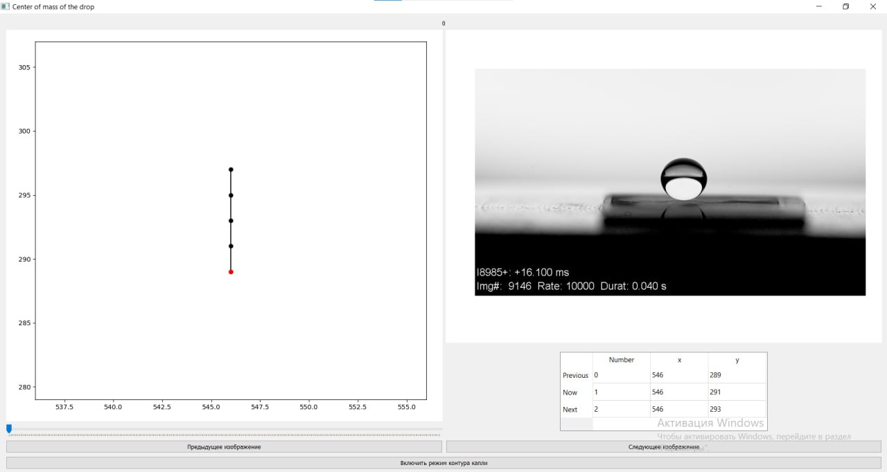

# Алмавик

 

    
   
   
  

   
Алмавик - программа для определения центра масс капли по изображению. Она предоставляет удобный интерфейс и функции обработки изображений, которые позволяют точно и быстро определить центр масс капли.

## Особенности

- **Определение центра масс**: Алмавик использует современные алгоритмы обработки изображений для точного определения центра масс капли.
- **Интерфейс**: Программа имеет интуитивно понятный интерфейс, который позволяет легко загружать изображения и просматривать результаты обработки.
- **Графическое представление**: Алмавик предоставляет графическое представление капли, позволяя визуально оценить ее форму и размер.

## Интерфейс:
- Кнопки "Previous Image" и "Next Image": отвечают за переключение картинок на предыдущую и следующую соответственно;
- Конпки "Enable Drop Contour mode" и "Disable Drop Contour mode": появляются в зависимости от включенного режима на данный момент, изначально показывается изображение без выделенного контура капли, но при нажатии на "Enable Drop Contour mode" он выделяется;
- Слайдер: необходим для быстрого переключения картинок, так как в нашей папке 401 изображение, слайдер помогает быстро перейти от первого изображения к последнему;
- График: на графике красной точкой обозначается нахождение центра масс на текущей картинке, 4 точки до нее относятся к предыдущим изображениям, а 5 точк после к следующим.

## Запуск

### Локальный запуск 
    1. Установите зависимости из файла requirements.txt, выполнив команду: 
    $ pip install -r requirements.txt
    2. Создайте папку "exp1" в корневой директории проекта. В этой папке будут храниться изображения.
    3. Для запуска Алмавик локально, выполните команду:
    $ python YPPRPO.py
### Запуск в Docker контейнере
    1. Загрузите Docker образ Алмавик из репозитория Docker Hub, выполнив команду: 
    $ docker pull markuslons/almavik
    2. Запустите контейнер, используя следующую команду: 
    $ docker run -it markuslons/almavik
### Запуск через pip
    Для скачивания проекта введите в терминале строку:
    $ pip install almavik
    Это автоматически установит все нужные зависимости проекта, также папку с тестовыми изображениями
    Чтобы запустить скачанную библиотеку, нужно создать и запустить python файл с данными строками кода:
    $ from almavik.YPPRPO import main 
    $ main()
    После запуска данного файла откроется дополнительное окно с последней версией проекта "Алмавик"
     
## Создатели 

  <table>
    <tr>
      <td align="center">
        
         
        <b>Markus</b>
      </td>
      <td align="center">
        
         
        <b>Blubbery</b>
      </td>
      <td align="center">
        
         
        <b>ViktoriaTix</b>
      </td>
    </tr>
  </table>

## Ссылки
https://pypi.org/project/almavik/

https://hub.docker.com/repository/docker/markuslons/almavik
